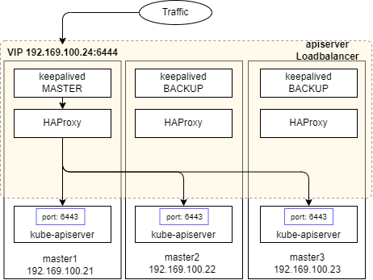

# HA Cluster를 지원하는 Kubernetes 설치 스크립트

kubernetes 1.21.1을 HA Cluster 구성을 하는 스크립트다. 소프트웨어 로드밸런싱으로 keekalived와 HAProxy를 사용한다. keepalived와 HAProxy의 설정은 [Option for Software Load Balancing](https://github.com/kubernetes/kubeadm/blob/main/docs/ha-considerations.md#options-for-software-load-balancing)을 참고.

본 스크립트에서 keepalived의 설정이 다른 부분은 아래와 같다.

- keepalived의 VLAN multicast를 지원하지 않는 경우를 위한 명시적인 unicast 설정 추가


## Kubernetes 설치

hostname은 master1, master2, master3, node1, node2, node3의 구성을 따른다. master와 node에는 공통적으로 다음 스크립트를 실행한다.

```babsh
$ bash 01_install_k8s.sh
```

master 의 경우 추가적으로 아래 스크립트를 실행한다.

```bash
$ bash 02_init_master.sh
```

master1에서는 `kubeadm init` 을 수행하는 추가적인 작업이 진행된다. `kubeadm init`이 완료되면 다른 master에 대해서 control-plane 등록을 해줘야 한다. 아래는 예시다.
```bash
sudo kubeadm join 192.168.100.24 --token XXXXXX \
      --discovery-token-ca-cert-hash sha256:XXXXXXXX \
      --control-plane --certificate-key XXXXXXXXX \
```

kubernetes control-plane 삭제는 다음과 같이 이루어진다.

```
# 사용 중인 control-plane 노드를 drain 시킨다.
# 이 때 필요하면 --ignore-daemonsets 옵션을 사용할 수도 있다.
$ kubectl drain <nodename>

# drain 시킨 노드를 삭제한다.
$ kubectl delete node <nodename>

# 모든 .kube 폴더 및 kuberenete apk를 uninstall 한다.
$ bash uninstall_k8s.sh
```


## 토폴로지

> https://kubernetes.io/ko/docs/setup/production-environment/tools/kubeadm/ha-topology/


중첩된 etcd 토폴로지로 구성된 스크립트로, keepalived와 HAProxy가 로드밸런서 역할을 한다.

- master1: 192.168.100.21
- master2: 192.168.100.22
- master3: 192.168.100.23
- loadbalancer: 192.168.100.24 (APIServer 대표 VIP)


## 트래픽 로드밸런싱 과정



1. apiserver로 발생되는 모든 트래픽은 대표 VIP로 향하게 된다.
2. VIP는 현재 master1에 부여되었으며, master1이 부재중일 때는, 다음으로 우선순위가 높은 master2에게 VIP가 부여된다.
3. 트래픽은 HAProxy를 통해 로드밸런싱되어 apiserver와 통신한다.
